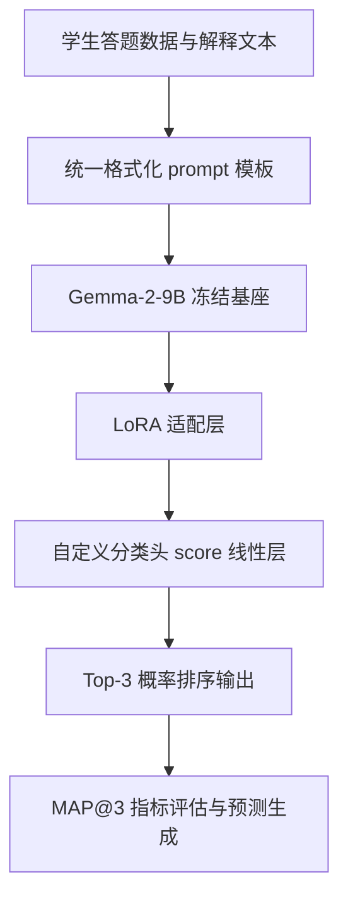
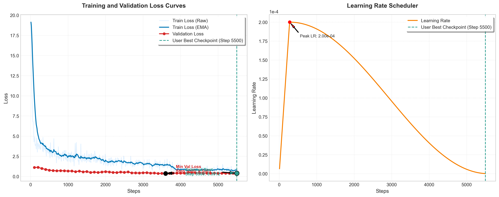

# 🏆 Charting Student Math Misunderstandings (学生数学误解诊断)

<p align="left">
  <a href="README.md">English</a> | <b>简体中文</b>
</p>

> **基于 LoRA 微调的 Gemma-2-9B 序列分类器**  
> 用于精准诊断学生数学解题误解的高性能微调方案。在保留测试集上取得了 **MAP@3: 0.93** 的卓越战绩！

---

## 📌 项目背景与教育价值

在数学教育领域，诊断出学生**为什么做错**（错误背后的思维逻辑）远比简单判断答案对错更有价值。学生的解题错误极少是随机发生的粗心大意，通常源自系统性、深层次的**认知误解 (Cognitive Misconceptions)**。

传统上，精确诊断这些数学误解需要经验丰富的教师手动阅读并分析学生自由阐述的解题思路（Student Explanation）。这种方式极度耗费人力与时间，且完全无法在大规模课堂或在线学习平台上实现实时、个性化的反馈。

**本项目旨在实现误解诊断管线的全自动化。** 通过构建统一的学生答题上下文——融合数学题干、所选错误选项、答题正确性标签及学生自由文本思路描述，我们的系统能以专家级的精度自动将学生的逻辑缺陷映射并分类至 **65 个细分数学误解类别**。这为智能辅导系统（ITS）及自适应学习平台（Adaptive Learning Platforms）提供了一个强有力的、即插即用的认知诊断核心引擎。

---

## 💻 核心模型与技术栈选型

为了在保证深度推理能力的同时，实现在主流 GPU 上高效、低门槛的本地化部署，本项目精心构建了以下顶尖的开源大模型技术栈：

* **骨干大模型 (Foundation Model)**: **Gemma-2-9B-IT** (Google)。
* **微调范式 (Fine-Tuning Paradigm)**: **PEFT / LoRA (低秩适应)**。通过冻结庞大的基座模型参数并仅训练少量的低秩更新矩阵，可训练参数占比被控制在 **< 1%**。这在大幅压低显存（VRAM）占用的同时，能有效克服全参数微调时的“灾难性遗忘”难题，保持了模型极强的通用推理基底。
* **技术栈全景 (Full Tech Stack)**:
  * **深度学习基础**：`Python 3.10+`, `PyTorch 2.0+` (针对 Ampere 架构的 bfloat16 混合精度深度优化)
  * **大模型与微调生态**：Hugging Face `transformers` (Gemma-2 核心结构化接口), `peft` (LoRA 核心引擎), `datasets` (高效流式数据加载)
  * **科学计算与机器学习**：`pandas`, `numpy`, `scikit-learn` (LabelEncoder 及高鲁棒的多分类数据集划分)
  * **监控与可视化 (Telemetry)**：`matplotlib` (用于 EMA 平滑损失函数与 Top-N 精度多维指标的可视化呈现)

---

## 🔄 数据与模型流水线流向



---

## 🛠️ 核心工程挑战与解决方案

在开发过程中，我们攻克了以下大模型微调的底层逻辑缺陷与工程瓶颈：

### 1. 自定义 PyTorch PEFT 分类器（解决 LLaMA-Factory 局限性）
标准的微调框架（如 *LLaMA-Factory*）主要基于 `AutoModelForCausalLM` 设计，无法原生支持判别式的序列分类任务。
* **解决方案**：基于 Hugging Face `AutoModelForSequenceClassification` 与 `peft` 框架开发了自定义微调脚本，自主构建了映射至 65 个类别的输出线性层。

### 2. 新增分类头持久化 Trick（解决参数丢失 Bug）
在 LoRA 微调中，由于基座模型被冻结，新加入的随机初始化分类头（即 `score` 线性层）如果在配置中被忽略，其权重将不会被保存进 adapter 检查点中，导致加载权重时失效。
* **解决方案**：在 `LoraConfig` 中显式配置 `modules_to_save=["score"]`。这使得在每次保存 checkpoint 时，新增分类头的权重能与 LoRA 适配器参数一同持久化。

### 3. 绕过 Hugging Face `datasets` 兼容性崩溃（解决 VideoReader 报错）
在较新的 PyTorch / Python 环境中，调用 `datasets.set_format(type='torch')` 会尝试从 torchvision 中导入已被废弃的 `VideoReader` 从而引发环境崩溃。
* **解决方案**：删除了原有的 `set_format` 调用。让数据保持原生字典状态，利用 PyTorch `DataLoader` 的 `DataCollatorWithPadding` 动态在 Batch 层面完成 tensor 映射，100% 规避了导入崩溃。

### 4. 32GB+ 显存极致吞吐优化（防 OOM 黄金超参）
* **原生 BF16 精度**：全线采用 Ampere 架构原生的 bfloat16 混合精度，确保大模型梯度更新的数值稳定性。
* **SDPA 闪电注意力机制**：调用 PyTorch 原生 flash-attention 机制（Scaled Dot Product Attention），大幅降低显存消耗并提高计算速度。
* **梯度检查点 (Gradient Checkpointing)**：开启后通过时间换空间，支持上下文长度扩展至 `MAX_LEN = 512`（拒绝由于截断导致推理链丢失）。
* **IO 吞吐调优**：`BATCH_SIZE = 4` 配合 `GRAD_ACCUM = 4`（等效批大小为 16），评估与保存步长设为 `500` 步，避免了过频的磁盘读写导致的计算等待。

---

## 📁 目录文件结构说明

```text
├── data/
│   ├── my_train.csv             # 清洗后的训练集数据（共 ~33,027 条样本）
│   ├── my_test.csv              # 测试集/保留验证集数据
│   └── my_test_labels.csv       # 测试集真实标签（用于 MAP@3 评估）
├── saves/
│   └── Gemma-2-9B/
│   └── Gemma2-9B-cv93         # 自动保存的 LoRA 各步数 Checkpoints 及权重（后面会上传到hugging face)
├── output/
│   ├── output.csv               # 导出的 Top-3 预测分类文件（符合 Kaggle 提交格式）
│   └── evaluation_results.png   # 自动绘制的测试集 Top-N 准确率柱状图
├── scripts/
│   ├── plot_loss.py             # EMA 收敛曲线与学习率变化高清图像绘制工具
│   └── ...                      # 其他辅助脚本（数据切分、标签修复等）
├── train_seqcls.py              # Gemma-2-9B 序列分类 LoRA 核心训练管线
├── gemma2_inference.py          # 极速批推理与 MAP@3 指标评测脚本
├── requirements.txt             # 严谨的 Python 环境依赖包版本锁表
└── README_ZH.md                 # 项目中文版技术文档（当前文件）
```

---

## 📊 评估表现与收敛分析

* **最佳权重模型**：`checkpoint-5500`
* **核心评估指标**：**MAP@3 (Mean Average Precision @ 3) = 0.93**
* **Top-N 命中准确率**：
  * **Top-1 准确率**: ~83.24%
  * **Top-3 准确率**: ~95.80%

### 收敛 Telemetry 曲线图
您可以一键运行 `plot_loss.py` 脚本来生成高颜值的 Train/Val 收敛对照图：



> [!NOTE]
> 从曲线图中可以看出，验证集 Loss 的理论最低点出现在 **Step 3600** ($Loss = 0.3683$)。但由于判别式任务决策边界的后熟效应，模型在 **Step 5500** 时的多分类整体泛化指标达到最优（MAP@3: 0.93）。这是大模型微调中非常典型且有意思的现象。

---

## 🚀 极速上手执行指南

### 1. 安装依赖环境
使用我们为您准备好的 `requirements.txt` 进行一键环境部署：
```bash
pip install -r requirements.txt
```
*提示：如果您的 bitsandbytes 版本过低导致无法启动，`train_seqcls.py` 会在最顶端自动拦截并为您静默升级至符合要求的兼容版本。*

### 2. 启动高性能微调训练
直接执行核心微调脚本，开启 LoRA 序列分类训练：
```bash
python train_seqcls.py
```
*脚本内含路径自动 fallback 逻辑，可在您的本地环境目录 `models/` 与 Autodl 云端目录 `/root/autodl-tmp/` 之间无缝切换。*

### 3. 一键批推理与 MAP@3 评测
加载 Step 5500 最佳适配器权重，在保留测试集上批量输出预测并计算指标：
```bash
python gemma2_inference.py
```
运行结束后，系统会为您产出：
* `output/output.csv` (Top-3 预测结果)
* `output/evaluation_results.png` (Top-N 准确率对照柱状图)

### 4. 绘制 Telemetry 训练图表
重新绘制训练集平滑 loss 曲线、验证集 loss 趋势以及 Cosine 学习率衰减图：
```bash
python scripts/plot_loss.py
```
图表将实时保存并更新至 `training_loss_curves.png`。

---

## 🏆 致谢与版权说明
本项目专门针对 *Kaggle: Charting Student Math Misunderstandings* 竞赛进行算法深度调优，基于 Hugging Face PEFT 与 PyTorch 框架构建。

感谢原作者在设计上给予的启发https://www.kaggle.com/code/kishanvavdara/ensemble-gemma-qwen-deepseek
